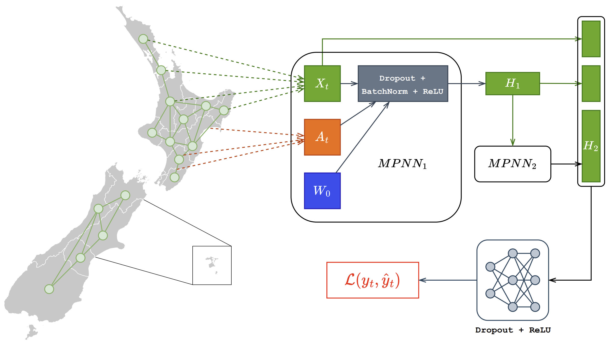

# [Predicting COVID-19 pandemic by spatio-temporal graph neural networks](https://arxiv.org/abs/2305.07731)



## Contributors
* Viet Bach Nguyen
* Nhung Nghiem
* Truong Son Hy (Correspondent / PI)


## Data


### Labels

We gather the ground truth for number of confiremed cases per region through open data for [Italy](https://github.com/pcm-dpc/COVID-19/blob/master/dati-province/dpc-covid19-ita-province.csv),
[England](https://coronavirus.data.gov.uk), [France](https://www.data.gouv.fr/en/datasets/donnees-relatives-aux-tests-de-depistage-de-covid-19-realises-en-laboratoire-de-ville/), [Spain](https://code.montera34.com:4443/numeroteca/covid19/-/blob/master/data/output/spain/covid19-provincias-spain_consolidated.csv}}) and [New Zealand](https://github.com/minhealthnz/nz-covid-data).
We have preprocessed the data and the final versions are in each country's subfolder in the data folder.


### Graphs

The graphs are formed using the movement data from facebook Data For Good disease prevention [maps](https://dataforgood.fb.com/docs/covid19/). More specifically, we used the total number of people moving daily from one region to another, using the [Movement between Administrative Regions](https://dataforgood.fb.com/tools/movement-range-maps/) datasets. We can not share the initial data due to the data license agreement, but after contacting the FB Data for Good team, we reached the consensus that we can share an aggregated and diminished version which was used for our experiments. 
These can be found inside the "graphs" folder of each country.These include the mobility maps between administrative regions that we use in our experiments until 12/5/2020, starting from 13/3 for England, 12/3 for Spain, 10/3 for France and 24/2 for Italy.
The mapplots require the gadm1_nuts3_counties_sf_format.Rds file which can be found at the Social Connectedness Index [data](https://dataforgood.fb.com/tools/social-connectedness-index/).

The graphs for New Zealand data are constructed based on geographical adjacency between regions as detailed by the associated publication. Economics and demographic data for New Zealand are gathered from the [official data agency of New Zealand](https://www.stats.govt.nz/).


## Code

### Requirements
To run this code you will need the following python and R packages:
[numpy](https://www.numpy.org/), [pandas](https://pandas.pydata.org/), [scipy](https://www.scipy.org/) ,[pytorch 1.5.1](https://pytorch.org/), [pytorch-geometric 1.5.0](https://github.com/rusty1s/pytorch_geometric), [networkx 1.11](https://networkx.github.io/), [sklearn](https://scikit-learn.org/stable/), dplyr, sf, ggplot2, sp.

#### Requirements for MAC
For MAC users, please use these versions: torch 1.7.0, torch-cluster 1.5.9 , torch-geometric 2.0.1 , torch-scatter 2.0.7, torch-sparse 0.6.12, torch-spline-conv 1.2.1., pystan 2.18.0.0 (for FB prophet).


### Run
To run the experiments with the default settings:

```bash

cd code

python experiments.py
 
python multiresolution_experiments.py 
```

## Citation

If you find the methods or the datasets useful in your research, please consider adding the following citations:

```bibtex
@misc{nguyen2023predicting,
      title={Predicting COVID-19 pandemic by spatio-temporal graph neural networks: A New Zealand's study}, 
      author={Viet Bach Nguyen and Truong Son Hy and Long Tran-Thanh and Nhung Nghiem},
      year={2023},
      eprint={2305.07731},
      archivePrefix={arXiv},
      primaryClass={cs.LG}
}
```

```bibtex
@InProceedings{pmlr-v184-hy22a,
  title = 	 {Temporal Multiresolution Graph Neural Networks For Epidemic Prediction},
  author =       {Hy, Truong Son and Nguyen, Viet Bach and Tran-Thanh, Long and Kondor, Risi},
  booktitle = 	 {Proceedings of the 1st Workshop on Healthcare AI and COVID-19, ICML 2022},
  pages = 	 {21--32},
  year = 	 {2022},
  editor = 	 {Xu, Peng and Zhu, Tingting and Zhu, Pengkai and Clifton, David A. and Belgrave, Danielle and Zhang, Yuanting},
  volume = 	 {184},
  series = 	 {Proceedings of Machine Learning Research},
  month = 	 {22 Jul},
  publisher =    {PMLR},
  pdf = 	 {https://proceedings.mlr.press/v184/hy22a/hy22a.pdf},
  url = 	 {https://proceedings.mlr.press/v184/hy22a.html},
  abstract = 	 {In this paper, we introduce Temporal Multiresolution Graph Neural Networks (TMGNN), the first architecture that both learns to construct the multiscale and multiresolution graph structures and incorporates the time-series signals to capture the temporal changes of the dynamic graphs. We have applied our proposed model to the task of predicting future spreading of epidemic and pandemic based on the historical time-series data collected from the actual COVID-19 pandemic and chickenpox epidemic in several European countries, and have obtained competitive results in comparison to other previous state-of-the-art temporal architectures and graph learning algorithms. We have shown that capturing the multiscale and multiresolution structures of graphs is important to extract either local or global information that play a critical role in understanding the dynamic of a global pandemic such as COVID-19 which started from a local city and spread to the whole world. Our work brings a promising research direction in forecasting and mitigating future epidemics and pandemics. Our source code is available at https://github.com/bachnguyenTE/temporal-mgn.}
}
```

```bibtex
@inproceedings{panagopoulos2020transfer,
  title={{Transfer Graph Neural Networks for Pandemic Forecasting}},
  author={Panagopoulos, George and Nikolentzos, Giannis and Vazirgiannis, Michalis},
  booktitle={Proceedings of the 35th AAAI Conference on Artificial Intelligence},
  year={2021},
}
```

**License**

- [MIT License](https://github.com/HySonLab/pandemic_tgnn/blob/main/LICENSE)
